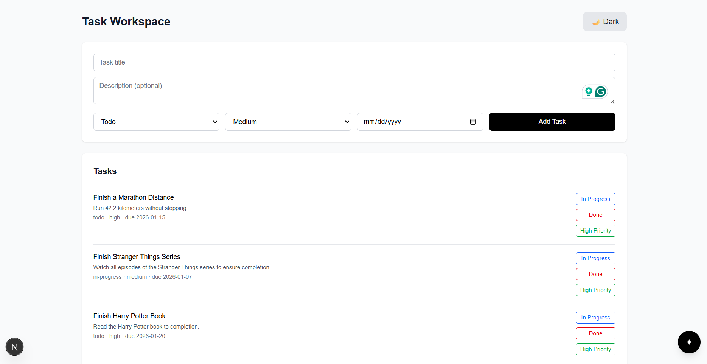
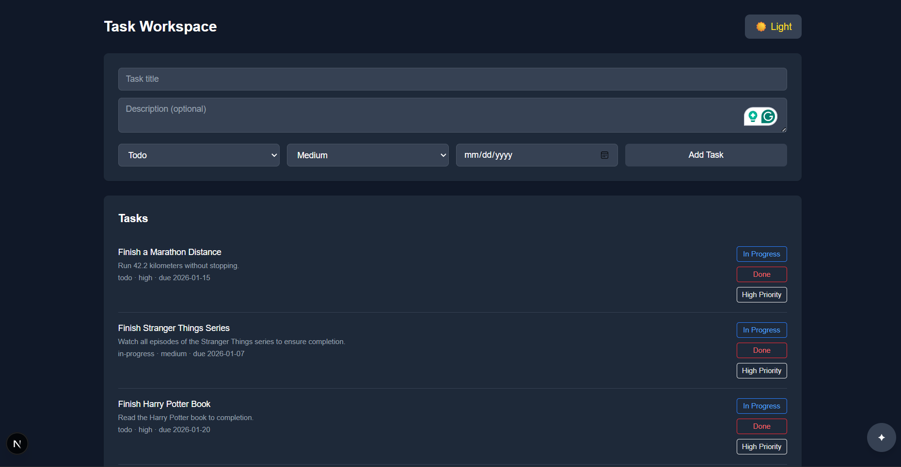
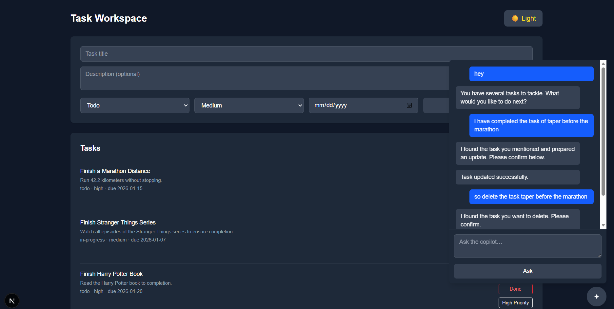

# Task Workspace MVP with AI Copilot

A full-stack task/workspace application with an embedded AI Copilot that helps users plan, organize, and act on their tasks in a safe, production-minded way.

---

## Quick Start

### Prerequisites
- Node.js (v16+)
- npm or yarn
- Git
- A text editor or IDE
- SQLite (included via better-sqlite3)

### Installation Steps (Exact)

#### Step 1: Clone the Repository
```bash
git clone <repository-url>
cd todo_mvp
```

#### Step 2: Set Up Backend
```bash
cd server
npm install
# Dependencies installed: express, better-sqlite3, groq-sdk, cors, dotenv
```

#### Step 3: Set Up Frontend
```bash
cd ../frontend
npm install
# Dependencies installed: next, react, tailwind-css, react-markdown
```

#### Step 4: Configure Environment (Optional)
Create a `.env` file in the `server` directory if using API keys:
```bash
cd ../server
# Add your Groq API key if needed
echo "GROQ_API_KEY=your_api_key_here" > .env
```

#### Step 5: Start the Backend Server
```bash
# From server directory
npm run dev
# Backend will start on http://localhost:4000
```

#### Step 6: Start the Frontend (New Terminal)
```bash
# From frontend directory
npm run dev
# Frontend will start on http://localhost:3000
```

#### Step 7: Open in Browser
Navigate to **[http://localhost:3000](http://localhost:3000)** and start creating tasks!

---

## Screenshots

### Light Mode


### Dark Mode


### AI Copilot in Action


---

## Project Structure

```

├── frontend
├── server
│   ├── db
│   │   └── index.js
│   ├── routes
│   │   ├── ai.js
│   │   ├── copilot.js
│   │   └── tasks.js
│   ├── services
│   │   └── llm.js
│   └── index.js
└── README.md

```

---

## Features Implemented

### 1. Core Task Management
- **Create Tasks**
  - Title (required)
  - Description (optional)
  - Status (Todo / In Progress / Done)
  - Priority (Low / Medium / High)
  - Due date (future dates only)
- **View & Organize**
  - Clean, responsive task list
  - Divide-by status for better visibility
  - Light and dark mode toggle for comfortable viewing
- **Update Tasks**
  - Change status directly from task list (Todo → In Progress → Done)
  - Update priority on the fly (Low / Medium / High)
  - Edit all task fields
- **Delete Tasks**
  - Confirmation modal prevents accidental deletions
  - Shows task title in confirmation dialog
- **Persistent Storage**
  - SQLite database stores all tasks securely
  - Data persists across sessions

### 2. UI/UX Features
- **Light & Dark Mode**
  - One-click theme toggle button in header
  - Smooth color transitions
  - Full UI consistency across both themes
  - All elements properly styled (inputs, buttons, dialogs, chat)
- **Responsive Design**
  - Works on desktop, tablet, and mobile
  - Tailwind CSS for modern styling
  - Clean, intuitive interface
- **Interactive Feedback**
  - Loading states
  - Hover effects on buttons
  - Smooth animations

### 3. AI-Powered Enhancements (Copilot)

#### a) Smart Task Title Suggestions
- AI generates title suggestions **while you type** (debounced for performance)
- Click a suggestion to auto-fill and refine
- Auto-generates description when you select a suggestion
- Suggestions close when input loses focus (UX optimized)

#### b) Copilot Chat Interface
- Floating **✦** button in bottom-right corner
- Expandable chat panel
- Scrollable chat history with auto-scroll to latest message
- Markdown-rendered AI responses
- Clean visual separation between user (dark) and AI (light) messages

#### c) Natural Language Task Creation
- Describe a task in plain English (e.g., "Create a task to redesign the homepage")
- Copilot understands intent and proposes structured task
- Shows proposal with inferred: Title, Description, Status, Priority, Due Date
- User confirms or cancels before creation

#### d) AI-Driven Task Updates
- Ask Copilot to update a task (e.g., "Mark the homepage redesign as done")
- Copilot identifies the task and proposes changes
- User reviews and confirms changes
- Confirmation message shown in chat

#### e) AI-Driven Task Deletion
- Request deletion through Copilot
- Explicit confirmation required (safety guardrail)
- Chat shows confirmation of successful deletion

#### f) AI-Powered Task Breakdown (Subtask Generation)
- Ask Copilot to break down a complex task
- Receives list of actionable subtasks with descriptions
- Subtasks shown in **scrollable panel** (UX optimized for many subtasks)
- **Close button** (✕) to dismiss panel
- Add each subtask individually with one click
- Each subtask inherits workflow (Todo/In Progress/Done)
- Perfect for: large projects, complex goals, multi-step processes

#### g) Copilot Intelligence
Copilot intelligently infers:
- **Title**: Clear, concise task name
- **Description**: Relevant context
- **Status**: Appropriate starting state (usually "todo")
- **Priority**: Based on language context (urgent → high, optional → low)
- **Due Date**: Understands relative dates ("tomorrow", "next Monday", "in 3 days")

---

## AI Integration Philosophy: Assistance vs. Automation

### The Problem with Pure Automation
Many AI tools make a critical mistake: **they automate too much**. An AI that directly mutates your data without asking is risky because:
- Users lose control over their workspace
- Mistakes can silently corrupt important data
- Trust erodes quickly when unexpected changes happen
- There's no audit trail of "why" a change happened

### Our Approach: AI as a Smart Assistant

We designed Copilot as an **intelligent assistant, not an automation tool**. Here's how:

#### 1. **Transparent Decision-Making**
Every AI suggestion is visible and reviewable:
- Title suggestions appear as clickable options
- Task proposals show all inferred fields
- Update proposals list exactly what will change
- Subtask breakdowns are displayed in a panel before action

#### 2. **Human-in-the-Loop (Required Confirmation)**
- AI **proposes** changes, users **approve** them
- No background mutations or silent changes
- Destructive actions (delete) require explicit "Yes, delete" confirmation
- User always has the last word

#### 3. **Clear Distinction Between Suggestion and Action**
- AI text appears in chat with context
- Proposals are shown in distinct cards with approval buttons
- System messages confirm successful actions
- No ambiguity about what the AI did vs. what the user did

#### 4. **Safety Guardrails**
- AI never invents task IDs or operates on unknown data
- Requests for unclear/ambiguous tasks trigger clarification
- All AI outputs are defensively parsed before execution
- No "guessing" on destructive operations

#### 5. **Building User Trust**
Users trust Copilot because:
- Every action is traceable in the chat history
- They see exactly what will change before confirming
- The AI is honest about limitations (asks for clarification when unsure)
- No surprises or unexpected behavior

### When Does AI Act Automatically?
We allow three types of "automatic" AI assistance where it reduces friction **without risk**:
1. **Title suggestions** – Just suggestions, user chooses to accept
2. **Description generation** – Populated after user confirms title (can be edited)
3. **Smart inference in proposals** – AI reads the proposal card, user approves the final result

All **state-mutating actions** (create, update, delete) require explicit user confirmation.

---

## Backend API Overview
- Create tasks using natural language prompts
- Update tasks (status, priority, due date, description) via Copilot
- Delete tasks via Copilot with explicit confirmation
- **AI-Powered Task Breakdown**: Automatically break complex tasks into smaller, achievable subtasks
  - Ask Copilot to decompose a task into actionable steps
  - Review suggested subtasks in a scrollable panel with close button
  - Add suggested subtasks individually with a single click
  - Each subtask inherits the workflow (todo/in-progress/done)
- Copilot infers:
  - Title
  - Description
  - Status
  - Priority
  - Due date (including relative dates like “tomorrow”)
- AI **never auto-executes** actions
- All create / update / delete operations require user confirmation
- Confirmation messages are shown inside the Copilot chat after actions

---

## Backend API Overview

### Total Backend Endpoints: **8**

#### Task APIs
1. `GET /health` – Health check  
2. `GET /tasks` – Fetch all tasks  
3. `POST /tasks` – Create a new task  
4. `PUT /tasks/:id` – Update task  
5. `DELETE /tasks/:id` – Delete task  
6. `GET /tasks/context` – AI-safe, read-only task context  

#### AI APIs
7. `POST /ai/task-suggestions` – AI title suggestions & description generation  
8. `POST /copilot/ask` – Copilot reasoning and task proposal endpoint  

---

## Tech Stack

### Frontend
- Next.js
- React
- Tailwind CSS
- react-markdown

### Backend
- Node.js
- Express.js
- SQLite (better-sqlite3)
- Groq LLM

---

## Safety & Guardrails
- Human-in-the-loop for all state changes
- Defensive parsing of AI outputs
- No silent failures or background AI actions
- Clear distinction between AI suggestions and system execution


---

## Future Scope
- Task completion analytics (e.g., weekly summaries)
- Due-date reminders and notifications
- Multi-user workspaces and collaboration 

---

## Status

All core requirements, AI-driven features, and safety guardrails have been implemented and integrated end-to-end.
